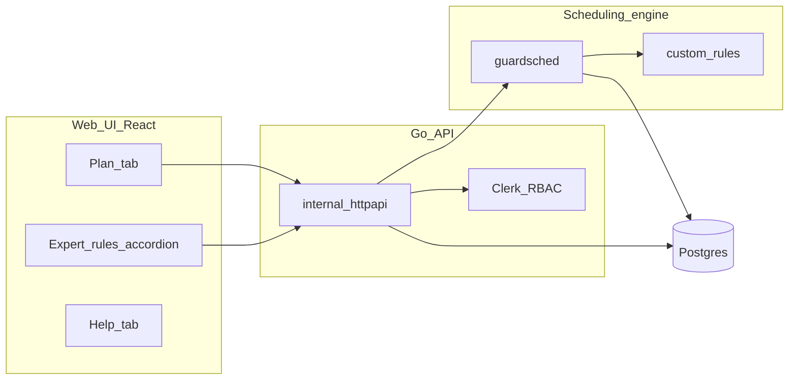

# Guard Scheduler

Configure soldiers and zones, plan draft duty proposals, apply one to the verified schedule, and review fairness stats.

This project was built using **vibe coding**: domain requirements and architecture were defined by the author, with much of the implementation, tests, and docs produced iteratively with [Cursor](https://cursor.com/) AI agents. Treat the codebase as you would any open-source project — review, test, and contribute.

## Capabilities

| Area | What you can do |
|------|-----------------|
| **Soldiers** | Roster, types, platoons, availability/status |
| **Slots & time zones** | YAML-backed zone config: patterns, weights, excludes, weekday off |
| **Plan** | Generate up to four draft proposals, compare, apply one to the verified schedule |
| **Expert rules** | Text rules at plan generation time (see below) |
| **Stats** | Fairness and workload reports after apply |
| **Users** | Clerk auth, invite-only admin vs readonly RBAC |
| **CLI** | Headless sim (`guardsim`) and DB admin (`guardcli`) |

**Slot patterns:** `rotating`, `full_day`, `full_day_team`, `windowed_slots`.


## Architecture



### Design

**Hard constraints** (eligibility): rest hours, cooldown, availability, slot type excludes, max consecutive duty, min free shifts after duty.

**Soft selection** (`hybrid_rel`): location/time/global fairness scores, then a random band among near-tied candidates.

**Assignment weight:** shift hours × location weight × time-zone weight × pattern multiplier.

See also [guard-scheduler-design-v2-scoring-fairness.md](guard-scheduler-design-v2-scoring-fairness.md) for the v2 scoring lookback design (future work; the current Plan sim uses full-run `hybrid_rel`).

### Repo layout

| Path | Role |
|------|------|
| `cmd/api/` | Production HTTP server (API + static UI) |
| `guardsched/` | Go scheduling engine |
| `internal/httpapi/` | REST handlers |
| `web/` | React + Vite UI |
| `guard_scheduler_sim.py` | Python reference sim + HTML reports |
| `cmd/guardsim/`, `cmd/guardcli/` | CLI tools |
| `b` | Build, test, and run helper |

**Stack:** Go 1.24, React 19, Vite 6, Postgres 16, Clerk, Docker. Deploy targets: Fly.io, Railway, or any Docker host.

## Example data

For local runs and docs, use the anonymized fixtures:

- [zones-example.yaml](zones-example.yaml) — mixed patterns (rotating gates, kitchen, team slot, reserve, west house)
- [roster-example.yaml](roster-example.yaml) — 79 soldiers, English names
- [roster-example-sick.yaml](roster-example-sick.yaml) — same roster with a sick-H scenario for tests

Additional scenarios live under `testdata/`.

## Expert rules

There is **no separate Expert page**. Rules live in:

- **Plan tab** → collapsible **Expert rules** accordion
- **Help tab** → **Expert rules** section (EN/HE)

Rules run **inside the simulator** before soldiers are picked. They override soft fairness, not hard YAML excludes.

### Syntax

One line per rule, space-separated `key:value` tokens. Comments start with `#`.

| Key | Meaning |
|-----|---------|
| `day` | 0-based plan day |
| `slot` | 1-based slot id |
| `shift` | 0-based block index (omit for full-day slots) |

| Operation | Effect |
|-----------|--------|
| `not` | Remove soldiers from the pool for matching seats |
| `exclude` | Plan-wide away (all days/slots/shifts) |
| `force` | Assign a specific soldier (prefer vs hard **Force** checkbox) |
| `force_type` | Require a roster type for a seat |
| `pin` | Pin a `full_day_team` slot to a platoon |
| `type_remap` | Move quota between types (e.g. `G>H:2`) |

Examples (copy `day` / `slot` / `shift` from the plan matrix tooltip):

```text
exclude:s34
day:0 slot:1 shift:0 not:s1
day:0 slot:1 shift:2 force:s42
day:0 slot:8 pin:3
day:0 slot:8 type_remap G>H:2
```

Named rule groups persist via `PUT /api/cfg/expert_rules`. Active text is sent on `POST /api/plan/generate`.

CLI parity:

```bash
go run ./cmd/guardsim ... -rules rules.txt
```

## Prerequisites

- **Docker + Docker Compose** (easiest), or Go 1.24+, Node 22+, Postgres 16
- [Clerk](https://clerk.com/) account for auth keys
- Python 3 (optional, for reference sim and pytest)

## Run locally

### Full stack (recommended)

```bash
cp .env.example .env   # set Clerk keys + BOOTSTRAP_ADMIN_EMAIL
docker compose up --build
# UI + API: http://localhost:8080
# Health:   http://localhost:8080/health
```

Or:

```bash
./b run
./b run --build
```

### Frontend dev

Run the API on port 8080, then:

```bash
cd web && npm install && npm run dev
# Vite on http://localhost:5173 (proxies /api to :8080)
```

### CLI simulation (no database)

```bash
go run ./cmd/guardsim -x 12 -y 4 -d 4 \
  --zones zones-example.yaml --roster roster-example.yaml --seed 42

python3 guard_scheduler_sim.py -x 12 -y 4 -d 4 \
  --zones zones-example.yaml --roster roster-example.yaml --seed 42
```

### Tests

```bash
./b test          # installs web/ npm deps automatically when needed
cd web && npm test
```

Plan UI parity pytest (`test_plan_ui_soldier_weight.py`) runs `npx tsx` against `web/src/lib/` and needs `cd web && npm ci` once if you run pytest directly without `./b test`.

### Admin CLI

```bash
./b cli users list
./b cli users invite --email you@example.com --role admin
```

### Python simulator 

python3 guard_scheduler_sim.py -x 12 -y 4 -d 1 --seed 42 --min-consecutive-free-hours 6 --zones zones_s1.yaml --min-free-shifts-after-duty 2

## Deploy

Primary path: **Fly.io** + **Neon Postgres** + **Clerk**.

```bash
fly deploy --build-arg VITE_CLERK_PUBLISHABLE_KEY='pk_...'
fly secrets set \
  DATABASE_URL='postgres://...@...-pooler.../neondb?sslmode=require' \
  CLERK_SECRET_KEY='sk_...' \
  BOOTSTRAP_ADMIN_EMAIL='you@example.com' \
  CORS_ORIGIN='https://your-app.fly.dev'
curl https://your-app.fly.dev/health
```

Also supported:

- **Docker** — multi-stage [Dockerfile](Dockerfile) (Node UI → Go API → Alpine, serves static + API on `:8080`)
- **Railway** — [railway.toml](railway.toml), same Dockerfile, health `/health`

**Clerk dashboard:** add your production origin to allowed origins.

**First deploy tip:** optional `CSP_REPORT_ONLY=1` secret (see [.env.example](.env.example) comments); remove after sign-in smoke test.

### Environment variables

| Variable | Purpose |
|----------|---------|
| `DATABASE_URL` | Postgres connection string |
| `CLERK_SECRET_KEY` | Clerk backend secret |
| `VITE_CLERK_PUBLISHABLE_KEY` | Clerk frontend key (build arg for Docker) |
| `BOOTSTRAP_ADMIN_EMAIL` | First admin user email |
| `CORS_ORIGIN` | Allowed browser origin (e.g. `https://your-app.fly.dev`) |
| `HTTP_ADDR` | Listen address (default `:8080`) |

See [.env.example](.env.example) for the full list.

## Documentation

- In-app **Help** tab (EN/HE) — soldiers, slots, plan workflow, expert rules, stats, algorithm
- [guard-scheduler-design-v2-scoring-fairness.md](guard-scheduler-design-v2-scoring-fairness.md) — scoring supplement

## License

Apache License 2.0 — see [LICENSE](LICENSE).
